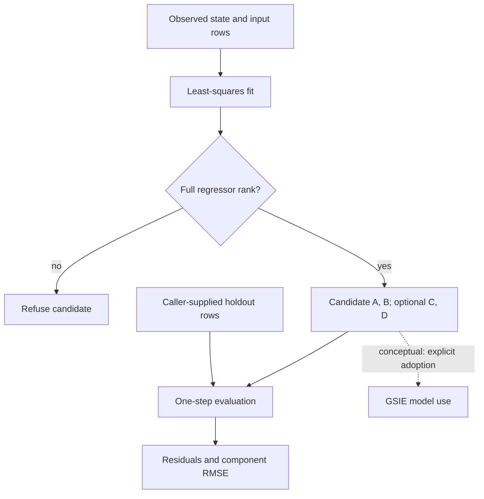

# Notations Linear Dynamics

**Fit candidate linear dynamics from observed trajectories and inspect rank, residuals and holdout error.**

[Run](#install-and-run) · [API](#api) · [Research profile](#research-profile) · [Numerical assumptions](docs/NUMERICS.md)

## Notation Systems and this instrument

**Notation Systems — Frontier Tooling and Instrumentation for Digital Futures.** We build computational instruments and operational tooling connecting scientific methods, specialized computation and human expertise.

This provider owns candidate fitting and numerical diagnostics, not model adoption or plant control. [Notations Systems Terminal](https://github.com/giasonpooni/Notations-Systems-Terminal) composes supported investigations; specialist implementations, evidence admission and creative game state retain their separate authority. Cartesian Graphics develops interactive worlds, simulation technology and digital IP. [Organization profile](https://github.com/giasonpooni/Notations-Systems-Terminal/blob/b41b84922d4963a9206202029afd1e78b9451f9c/PUBLIC_POSITIONING.md).

| Identity | Scope |
| --- | --- |
| User-facing capability | **Dynamics Fitter** |
| Proposed NET operation | `dynamics.fit` |
| Current repository | `Notations-Linear-Dynamics-Testbed` |
| Existing provider/import | System Identification and Dynamics Testbed / SIDT; `sidt` |
| Operations | `sidt.discrete-lti-lstsq.v1`, `sidt.declared-lti-identification.v1` |
| Boundary | Fully observed, discrete-time linear dynamics; not hidden-state realization identification |

`dynamics.fit` is an interface target, not a newly installed command or nonlinear physics-engine fitting service. NET / `net` / `ciw`, imports, historical pins and numerical contracts remain unchanged. A fitted candidate is not automatically adopted, stable or physically validated; parameter covariance in the declared path remains unknown.

## Candidate fitting and evaluation

The implemented model is

\[
x_{k+1}=Ax_k+Bu_k,\qquad y_k=Cx_k+Du_k.
\]

The state trajectory must be supplied explicitly. Optional measured output rows permit fitting `C` and `D`. The implementation cannot identify a hidden state realization from inputs and outputs alone.



Solid arrows show local fitting and evaluation. Deficient rank can expose insufficient excitation; passing the gate does not establish general excitation or physical identifiability. The caller establishes holdout independence. The dotted arrow is a downstream relationship, not automatic adoption.

## Install and run

Requires Python 3.11 or newer.

```bash
python -m pip install -e '.[test]'
python -m pytest
python examples/replay.py
```

The replay constructs a known two-state system, fits it, evaluates a trajectory generated with a separate seed, and prints matrices, rank, singular values, residuals and holdout error. It makes no network requests or operational state changes.

## API

```python
import numpy as np
from sidt import fit_lti

# states has N+1 rows; inputs has N transition-aligned rows.
x = np.array([[1.0], [0.8], [0.9], [0.52]])
u = np.array([[0.0], [1.0], [-1.0]])
candidate = fit_lti(
    x, u,
    sample_interval=0.1,
    state_names=("temperature_delta",), state_units=("K",),
    input_names=("heater_power",), input_units=("W",),
)
print(candidate.A, candidate.B)
print(candidate.diagnostics.rank)
print(candidate.candidate_digest)
```

Provide `outputs`, `output_names`, and `output_units` together to fit the output equation. `candidate.predict_next` and `candidate.predict_output` take matching sample-row matrices. `evaluate_one_step(candidate, states, inputs, outputs=...)` measures one-step residuals; the caller establishes independence from training data.

| Result | Meaning |
| --- | --- |
| `A`, `B`, optional `C`, `D` | Candidate matrices in declared coordinates |
| `metadata` | Sample interval, variable order, unit labels, operation identifier and optional conditioning reference |
| `diagnostics` | Rank, singular values, rank cutoff, residual arrays/sums of squares and residual degrees of freedom |
| `candidate_digest` | Content identity for matrices, metadata, schema and rank policy |

Rank-deficient regression raises `NonIdentifiableError` and returns no usable model. Finite values, dimensions, labels and positive sample interval are checked. Units are recorded labels; dimensional consistency and timestamp alignment remain caller responsibilities.

## System role

The [declared identification API](docs/DECLARED_IDENTIFICATION.md) retains reference-clock times, frames, ordered coordinates, evidence/sample references, optional disjoint holdout declarations and a rank/conditioning gate. It returns a conditional `A`/`B` candidate with unknown parameter covariance. Replay preserves numerical identity while assigning separate execution/result identities. Run `python examples/declared.py` for the synthetic example.

PPDA supplies observations; STFE may condition streams, with its operation/result recorded in `conditioning_reference`. SIDT fits a candidate. GSIE may consume an explicitly selected model; OIT diagnoses declared `A`/`C`; SET evaluates estimation/model mismatch. NET coordinates qualified execution; model adoption remains a separate decision.

SIDT owns neither evidence truth, canonical state, admission, policy, observer tuning nor actuation. A successful fit or digest establishes no physical/causal validity, stability or operational authority. See [contract](docs/CONTRACT.md), [numerics](docs/NUMERICS.md) and [stack role](docs/STACK_ROLE.md).

## Optional SET conformance export

```bash
python -m pip install -e '.[test,exchange]'
python examples/exchange.py
```

The validator is pinned to SET revision `bd261a765281a95312f7c91a3857233476294c5b`. `sidt.exchange.export_result` maps supplied JSON into `notation.instrument.result-artifact.v1`. The example exports fitted matrices, full input/result records and unknown parameter covariance. Its timestamps, references and all-zero source revision are synthetic declarations.

Conformance does not authenticate provenance, independently verify the fit, adopt it or supply a native CIW execution adapter. Exchange tests skip without the optional package.

## Research profile

**Question:** when does a candidate model remain useful outside the trajectory used to fit it? The two-state and declared-identification examples provide bounded specimens for rank, holdout separation, conditioning and model mismatch.

Compare one-step and appropriately designed rollout errors, excitation regimes, missing/invalid inputs and reproducibility before optimizing execution. A small residual does not prove the model's physical meaning; preserving a fit under representation changes requires the same inputs and assumptions.

[Shared research protocol](https://github.com/giasonpooni/Notations-Systems-Terminal/blob/b41b84922d4963a9206202029afd1e78b9451f9c/RESEARCH_PROGRAMME.md). Cross-language implementations, CUDA and automatic telemetry need separate qualification. This documentation changes no runtime code, tests, dependencies, licences or release status and claims no new test run.

## License

MPL-2.0. See [LICENSE](LICENSE). Historical repository names remain compatibility context, not new packages or rewritten evidence identities.
